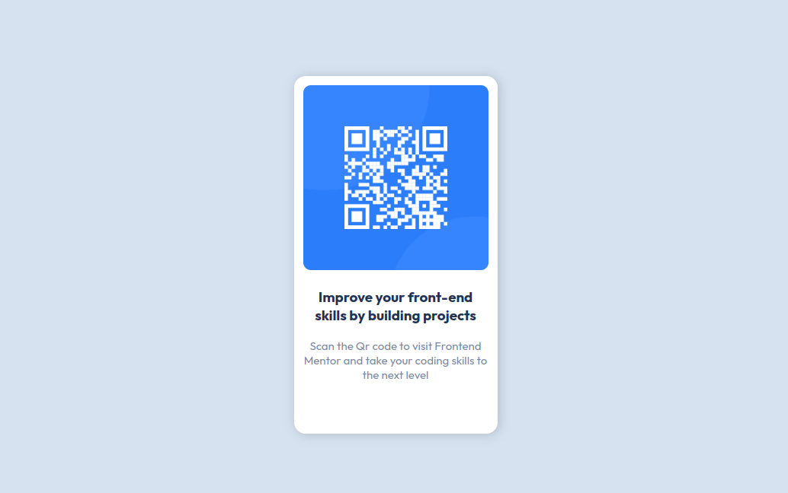

# Frontend Mentor - QR code component solution

This is a solution to the [QR code component challenge on Frontend Mentor](https://www.frontendmentor.io/challenges/qr-code-component-iux_sIO_H). Frontend Mentor challenges help you improve your coding skills by building realistic projects. 

## Table of contents

- [Overview](#overview)
  - [Screenshot](#screenshot)
  - [Links](#links)
- [My process](#my-process)
  - [Built with](#built-with)
  - [What I learned](#what-i-learned)
- [Author](#author)

## Overview

### Screenshot

### Links

- Solution URL: [here](https://github.com/BenzidaneMo/QR-code-component)
- Live Site URL: [here](https://benzidanemo.github.io/QR-code-component/)

## My process

### Built with

- Semantic HTML5 markup
- CSS custom properties
- CSS Grid

### What I learned

During the QR code component challenge using HTML and CSS, I learned several important techniques that helped me to create a visually appealing and functional component. 

- One of the key takeaways was **how to center a div** element using CSS grid, which allowed me to position the container on the page precisely. 
- I also learned **how to use variables** to refer to colors, which made it much easier to update the color scheme of my component without having to search and replace every instance of a specific color value.
- Finally, I gained an understanding of **how to use media queries** to make my website more dynamic and responsive, which is critical for ensuring that the component looks good on screens of all sizes.

By applying these techniques, I was able to create a perfect clone that met the requirements of the challenge.

## Author

- Frontend Mentor - [@BenzidaneMo](https://www.frontendmentor.io/profile/BenzidaneMo)
- Twitter - [@Miracleinvoker_](https://twitter.com/Miracleinvoker_)
